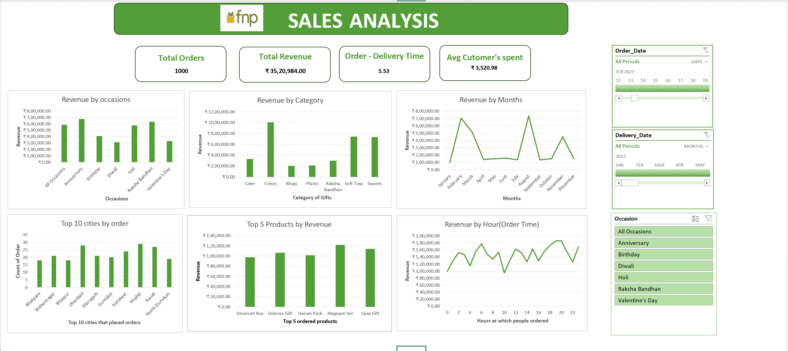

# FNP Sales Analysis – Excel Project

Excel-based sales analysis and interactive dashboard project.

## 📊 Executive Summary

This Sales Analysis project provides an overview of the company's sales
performance by analyzing **1,000 orders** across different occasions,
product categories, products, cities, months, and order timings.

The objective of the analysis is to understand major revenue contributors,
identify customer purchasing patterns, evaluate geographical demand, and
examine delivery performance.

The business generated **₹35,20,984** in revenue from 1,000 orders, with
an **average order value of ₹3,520.98**. The average order-to-delivery
time was **5.53 days**.

## 🎯 Business Objectives

- Analyze overall sales and revenue performance
- Identify revenue contribution by occasion and product category
- Analyze monthly sales trends and seasonality
- Identify top-performing products
- Analyze geographical order distribution
- Understand order patterns by time of day
- Evaluate delivery performance
- Analyze the relationship between order quantity and delivery time

## 🛠️ Tools & Skills Used

- Microsoft Excel
- Data Cleaning
- Pivot Tables
- Pivot Charts
- Excel Formulas
- Data Analysis
- Data Visualization
- Dashboard Creation

## 📈 Dashboard

## 🔍 Key Business Insights

### 1. Overall Sales Performance

The company generated **₹35.21 lakh** in revenue from 1,000 orders,
with an average order value of approximately **₹3,521**.

### 2. Occasion-wise Revenue

**Anniversary** orders generated the highest revenue among the individual
occasions, followed by **Raksha Bandhan** and **Holi**.

This indicates that occasion-based purchasing is an important contributor
to overall sales.

### 3. Category-wise Revenue

**Colors** generated the highest revenue, followed by **Soft Toys and
Sweets**.

These categories can support decisions related to inventory planning,
product promotion, and category-level sales strategies.

### 4. Monthly Revenue Trend

Revenue varied considerably across the year, with major revenue peaks
during **February and August**.

This indicates the influence of seasonality and occasion-driven purchasing
patterns on sales performance.

### 5. Top-Performing Products

**Magman Set** generated the highest revenue among the analyzed products,
followed by **Quia Gift** and **Dolores Gift**.

### 6. Geographical Order Distribution

Among the top cities analyzed, **Imphal** recorded the highest number of
orders, followed by **Kovil** and **Dhanbad**.

This analysis can support regional marketing, inventory allocation, and
delivery planning.

### 7. Order-Time Analysis

Revenue varied throughout the day, with relatively higher revenue during
several **evening hours**.

Understanding these patterns can support staffing and operational planning
during high-demand periods.

### 8. Delivery Performance

The average order-to-delivery time across the 1,000 orders was
**5.53 days**.

### 9. Quantity vs Delivery Time

The analysis indicates that **order quantity does not have a significant
relationship with delivery time**.

This suggests that factors such as delivery location, product availability,
logistics, or processing time may have a greater influence on delivery
duration.

## 💡 Overall Conclusion

The analysis shows that sales performance is influenced by **product
categories, occasions, seasonal demand, geographical distribution, and
ordering times**.

The business generated **₹35.21 lakh from 1,000 orders**, with an
**average order value of ₹3,520.98** and an **average delivery time of
5.53 days**.

These insights can support better inventory planning, targeted marketing
during high-demand occasions and months, regional sales strategies,
product-level decision-making, and delivery operations.

## 📁 Project Files

- **FNP_Sales_Analysis.xlsx** – Excel analysis and dashboard
- **Dashboard.png** – Dashboard preview

## 📂 Dataset

The raw dataset used for this project was obtained from the following
GitHub repository:

[View Original Dataset](https://github.com/Ayushi0214/FNP---Excel-Project/tree/main/fnp%20datasets)

The dataset is credited to the original source repository. The analysis,
Excel calculations, visualizations, and dashboard presented in this
repository are part of this project.

## 👤 Project

**FNP Sales Analysis – Excel**

Tools: **Microsoft Excel**
